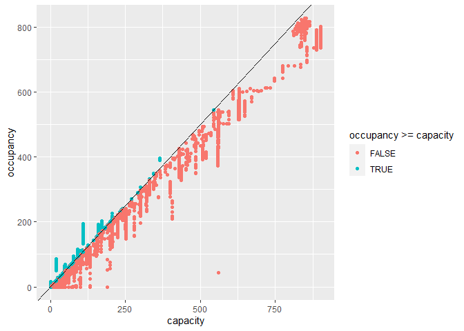
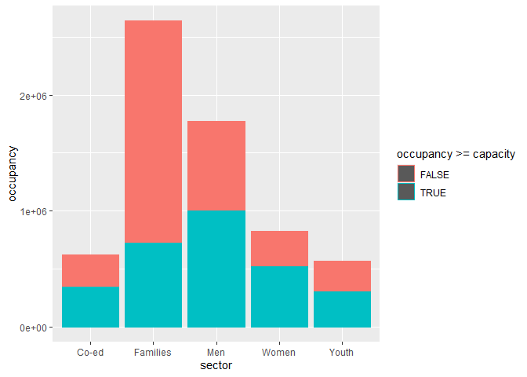

2020-12-01 - Toronto shelter data
---------------------------------

Load data.

``` r
library(tidyverse)
shelters <- readr::read_csv('https://raw.githubusercontent.com/rfordatascience/tidytuesday/master/data/2020/2020-12-01/shelters.csv')
```

Remove NAs from data.

``` r
shelters <- shelters %>% drop_na()
```

Plot occupancy against capacity to see if any shelters are overfilled.

``` r
ggplot(data = shelters) + 
  geom_point(mapping = aes(x = capacity, y = occupancy, 
                           colour = occupancy >= capacity)) +
  geom_abline(slope = 1)
```



Plot occupancy against sector to see which sectors are the most
overfilled.

``` r
ggplot(data = shelters) + 
  geom_bar(mapping = aes(x = sector, y = occupancy, 
                         colour = occupancy >= capacity), 
                         stat = 'identity')
```


