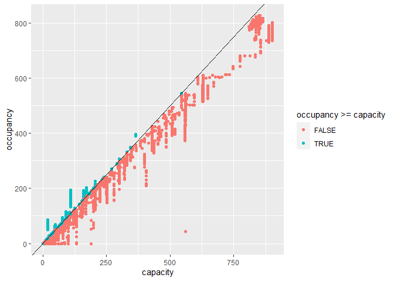
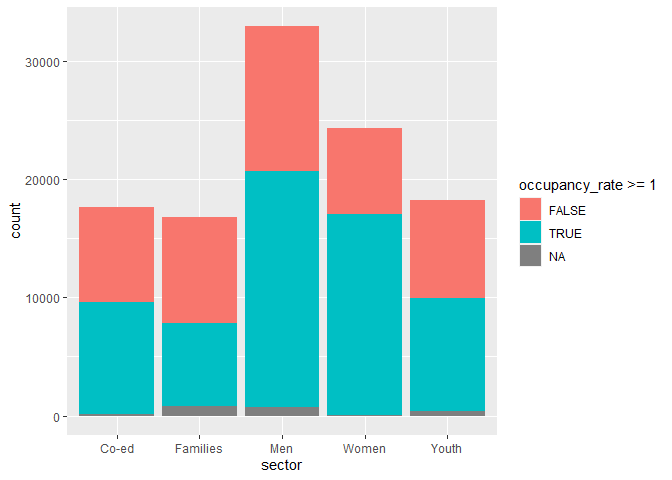

2020-12-01 - Toronto shelter data
---------------------------------

Load data.

    library(tidyverse)
    shelters <- readr::read_csv('https://raw.githubusercontent.com/rfordatascience/tidytuesday/master/data/2020/2020-12-01/shelters.csv')

Remove NAs from data and add occupancy rate.

    shelters <- shelters %>% drop_na() %>% 
      mutate(occupancy_rate = occupancy/capacity)

Calculate occupancy rate of shelters. Remove shelters with 0 capacity.

    occupancy_rate <- shelters$occupancy/shelters$capacity

    shelters <- shelters %>% filter(occupancy_rate != 'Inf')

Plot occupancy against capacity to see if any shelters are overfilled.

    ggplot(data = shelters) + 
      geom_point(mapping = aes(x = capacity, y = occupancy, 
                               colour = occupancy >= capacity)) +
      geom_abline(slope = 1)

Plot occupancy rate against sector to see which sectors are the most
overfilled.

    ggplot(data = shelters) + 
      geom_bar(aes(x = sector, fill = occupancy_rate>=1))

