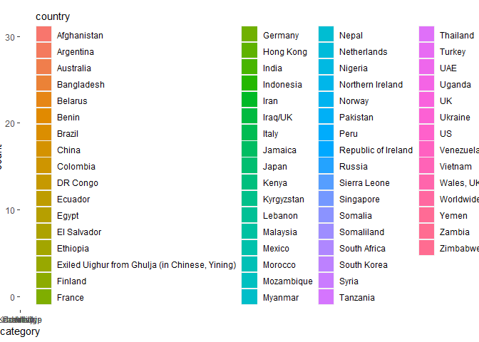

2020-12-08 - Women of 2020
==========================

``` r
library(tidyverse)

# load data 
women <- readr::read_csv('https://raw.githubusercontent.com/rfordatascience/tidytuesday/master/data/2020/2020-12-08/women.csv')
```

``` r
# distribution of categories by country
ggplot(data = women) +
  geom_bar(aes(x = category))
```



What roles are the most common among the Women of 2020?

``` r
library(wordcloud2)

rolecount <- table(women$role)
wordcloud2(rolecount)
```
