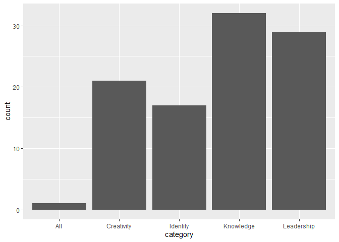

2020-12-08 - Women of 2020
==========================

``` r
library(tidyverse)

# load data 
women <- readr::read_csv('https://raw.githubusercontent.com/rfordatascience/tidytuesday/master/data/2020/2020-12-08/women.csv')
```

``` r
# distribution of categories by country
ggplot(data = women) +
  geom_bar(aes(x = category))
```



What words in roles appear most frequently among the Women of 2020?

``` r
library(wordcloud2)
library(webshot)
library(htmlwidgets)

rolecount <- table(women$role)
rolecloud <- wordcloud2(rolecount, size = 1.5)
saveWidget(rolecloud, "role_wordcloud.html", selfcontained = F)
webshot("role_wordcloud.html", "role_wordcloud.png", delay = 5, vwidth = 2000, vheight = 2000)
```


