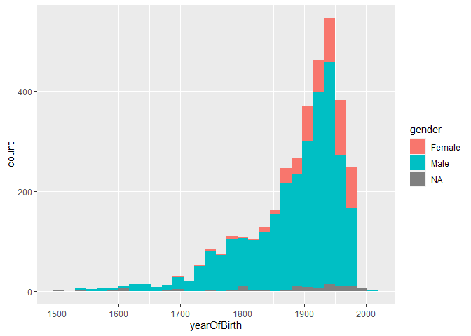

2021-01-12 - Tate Art Museum
============================

``` r
library(tidyverse)

# load data
artists <- readr::read_csv("https://github.com/tategallery/collection/raw/master/artist_data.csv")

attach(artists)
```

Explore data

``` r
sum(is.na(placeOfBirth))
```

    ## [1] 492

``` r
sum(is.na(yearOfBirth))
```

    ## [1] 60

``` r
ggplot(data = artists, mapping = aes(x = yearOfBirth, fill = gender)) + 
  geom_histogram()
```


